<p align="center">
  
</p>

<h1 align="center">Real-Time Data Streaming Application</h1>

## Agenda

1. [Log in to Confluent Cloud](#log-in-to-confluent-cloud)
2. [Create Confluent Cloud Environment, Cluster and API Keys](#create-confluent-cloud-environment-cluster-and-api-keys)
3. [Create Datagen Connectors](#create-datagen-connectors)
4. [Configure your S3 bucket and Provider Integration](#configure-your-s3-bucket-and-provider-integration)  
   - [Enable Tableflow Integration](#configure-your-s3-bucket-and-provider-integration)
5. [Explore the Stream Lineage](#explore-the-stream-lineage)
6. [Explore the Application](#explore-the-application)
7. [Clean Up Resources After the Workshop](#clean-up-resources-after-the-workshop)


## Prerequisites
Before you begin, ensure you have the following installed on your system:
- **Python 3** (version 3.12 recommended)
- [AWS Account with S3 Access](https://docs.aws.amazon.com/AmazonS3/latest/userguide/create-bucket-overview.html): You can create or access an Amazon S3 bucket and configure IAM roles and policies.
- [Snowflake Account](https://app.snowflake.com/)

## Objective
With Tableflow Catalog Integration, Tableflow acts as the catalog provider. Kafka topics are materialized as Iceberg tables stored in cloud storage (such as S3) and registered with Tableflow's built-in REST Catalog. Snowflake connects to this Tableflow REST Catalog as an external compute/query engine, using API credentials (API key and secret) generated within the Confluent Cloud Console. All metadata and table management remain under Tableflow’s control, and authentication is handled via Tableflow’s REST API keys—not Snowflake OAuth or native service connections. This approach is ideal when you want centralized catalog operations within Tableflow, while enabling Snowflake to query and analyze data without transferring catalog ownership.

## 1. Log in to Confluent Cloud

To get started, you'll need an active **Confluent Cloud** account.

1. **Sign up** for a free account: [Confluent Cloud Signup](https://confluent.cloud)
2. Once logged in, click the **menu icon (top-right)** → go to **Billing & payment**
3. Under **"Payment details & contacts"**, enter your **billing information**

Note : When you sign up for a Confluent Cloud account, you will get free credits to use in Confluent Cloud. This will cover the cost of resources created during the workshop.

## 2. Create Confluent Cloud Environment, Cluster and API Keys

1. Create a new **Environment** in [Confluent Cloud](https://confluent.cloud)
   
2. Create a **Standard Kafka Cluster** in your nearest region
   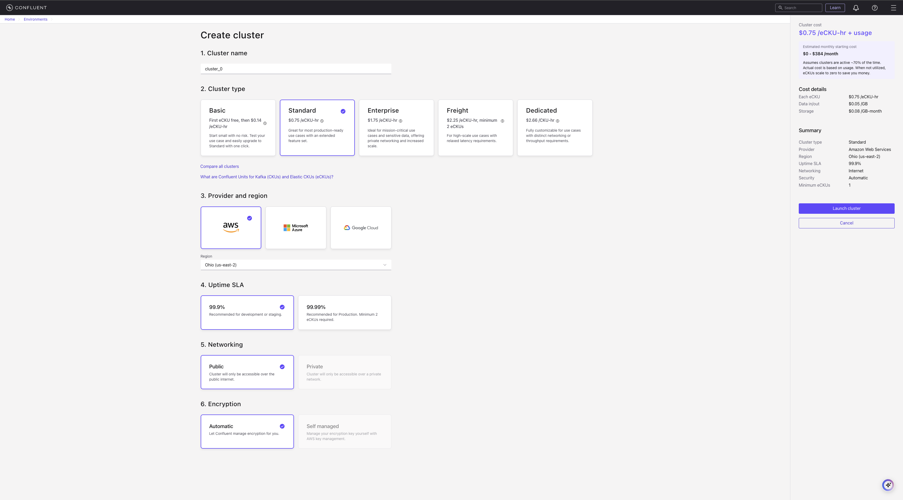
3. Generate **API Keys** and update the values in `client.properties`
#### Steps to Create API Keys
- Go to the **API Keys** section.
- Select **"My Account"** for generating the API keys.
   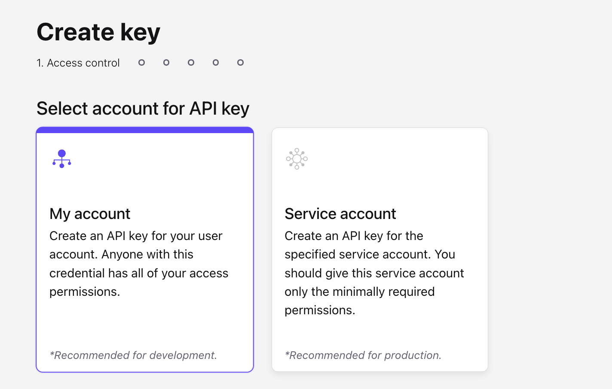
- Download the **API Key** and **Secret**, to update them in your `client.properties` file (All required values will be present in client.properties).
   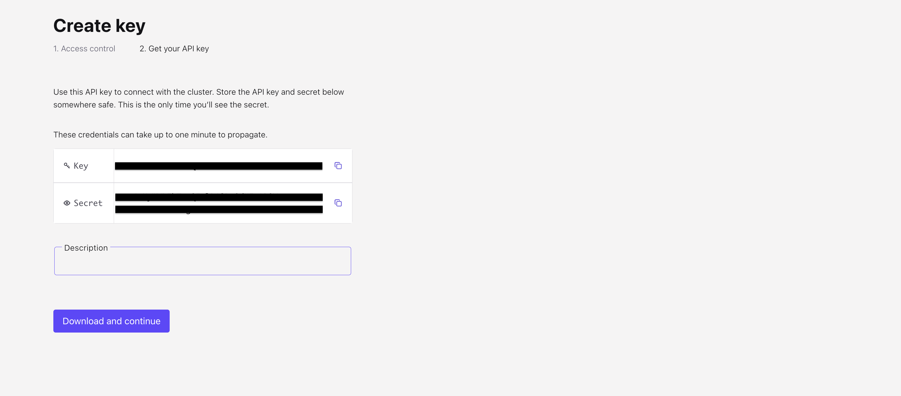

## 6. Create Datagen Connectors

1. Find the environment you created and select it from the list of Environments

2. You should now see your **Environment Overview** screen that shows your Kafka Cluster. **Click into your Kafka cluster**.

3. On the Cluster Overview screen, you will see Connectors on the left hand screen. Click on Connectors and then search for **Datagen Source** or click the datagen source, it is usually one of the first connectors on the page.

    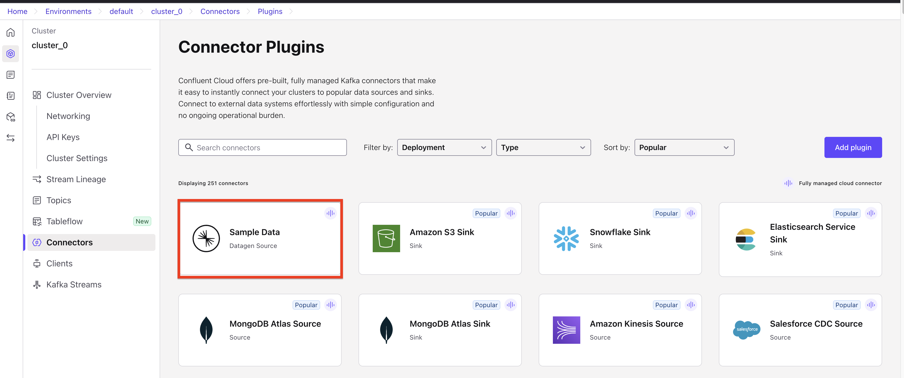
4. Choose the Orders Sample Data. 
5. Click **Launch**
6. This will start a **Datagen Source** Kafka connector that 
writes User data to a Kafka topic called sample_data_orders. 

    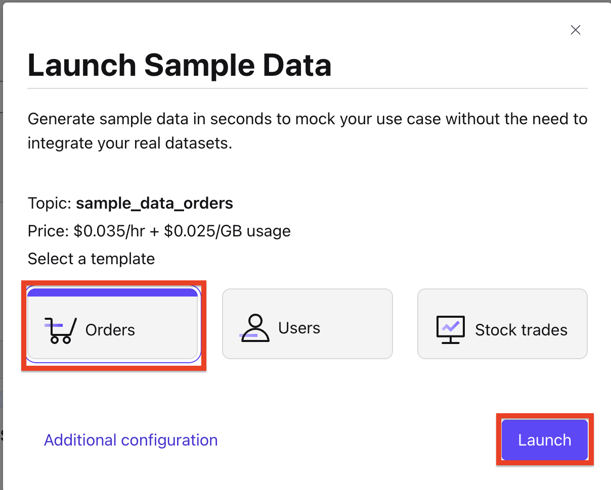

7. You will then see the connector you created from the Connector Screen, transitioning from Provisioning state to Running. 
8. Repeat this process to create another Datagen Source using the **Users** sample dataset. Once you have a connector, you should see the option to **+ Add Connector** at the top right. Use this button to create a new datagen connector. 

    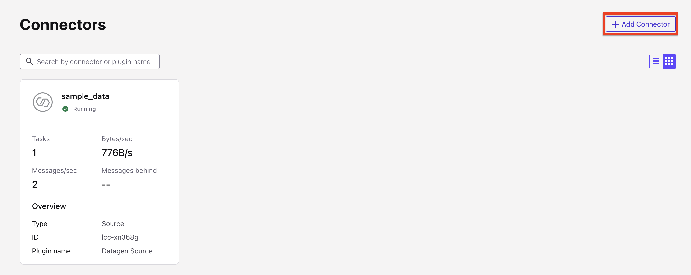

    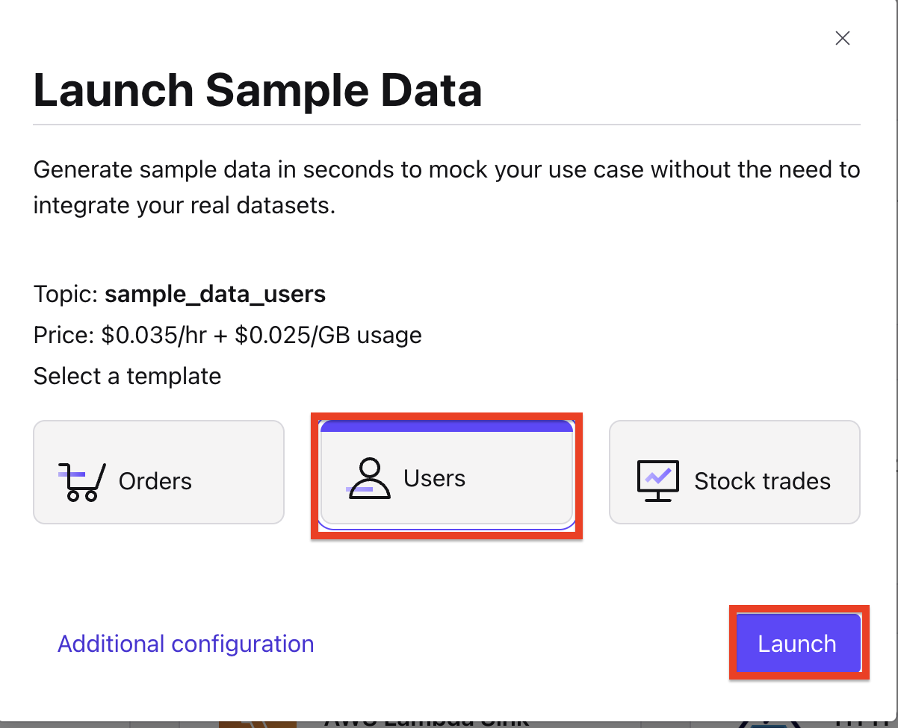
9. Once finished, you should have two Datagen sources, **sample_data** and **sample_data_1** in running state on the Connectors screen.

10. Verify that the subsequent Kafka topics have been created by navigating to the Topics menu on the left-hand navigation bar. You should see one topic called **sample_data_users**, and another called **sample_data_orders**, each with 6 partitions.
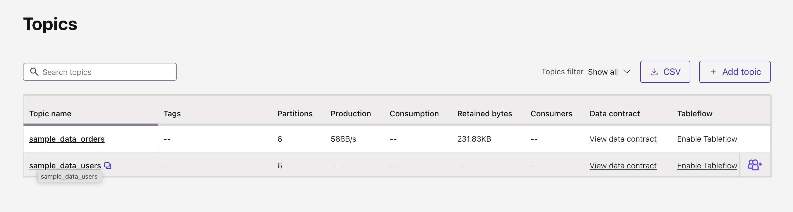

## 7. Configure your S3 bucket and Provider Integration

### Configure your Amazon S3 Bucket

1. If you already have an Amazon S3 bucket, feel free to skip to the next section
2. In a new tab, navigate to the Amazon S3 console or click [here](https://us-east-1.console.aws.amazon.com/s3/home?region=us-east-1#)
3. Click on Create Bucket on the top right.
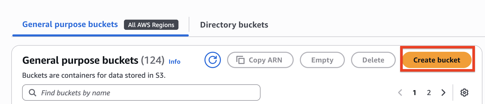
4. Leave everything default and give your bucket a name. The name of the bucket must be unique so let’s name it `tableflow-s3-bucket`.
    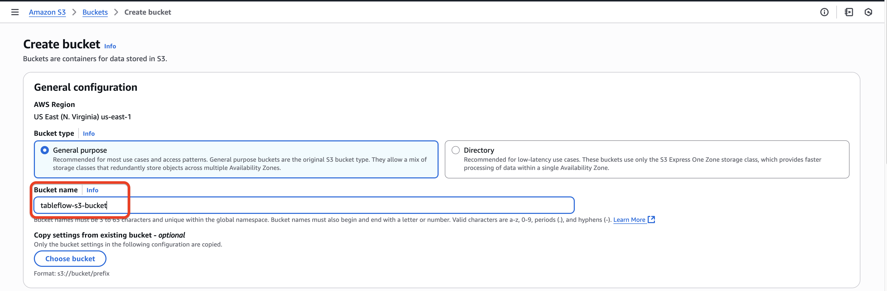
5. Leave the rest of the options as default, scroll down and click Create Bucket. 

### 👉 Steps to Add Provider Integrations for AWS S3

### Step 1: Configure Storage Provider Integration (Confluent Cloud)

Now, let's start the process in Confluent Cloud to connect to the S3 bucket.

1.  Navigate back to your **Confluent Cloud** console.
2.  Within your Environment's Cluster, click on **Tableflow** in the left-hand menu.
3.  In the center of the Tableflow page, find the option related to storage connections and click **Go to Provider Integrations**. *(Note: UI text might vary slightly)*.
4.  Click **+ Add Integration**.
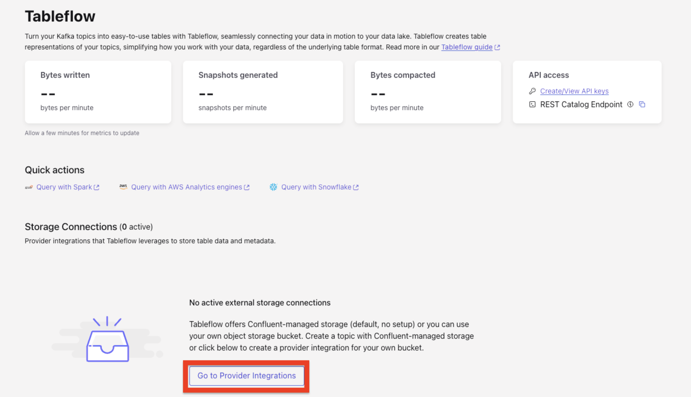
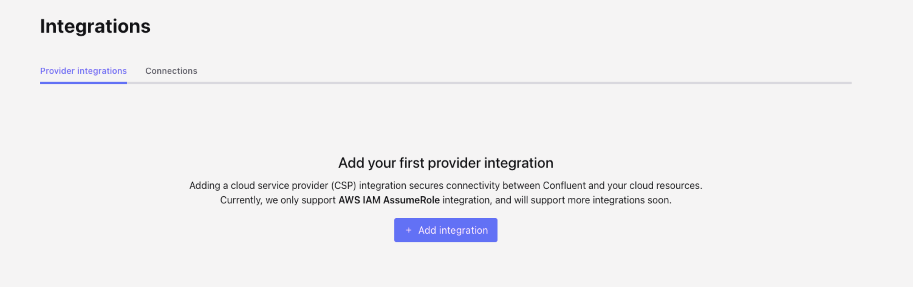 
5.  Choose to **create a new role** when prompted and click **Continue**.
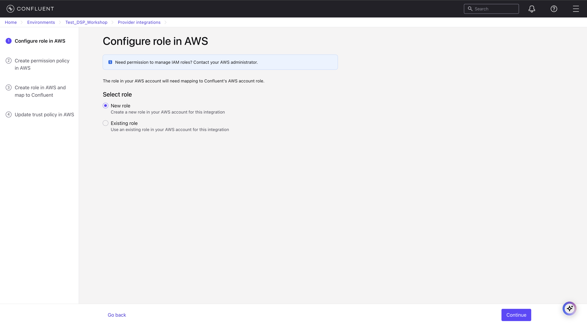
6.  On the "Create Permission Policy in AWS" screen, ensure **Tableflow S3 Bucket** is selected (or similar option representing S3 access).
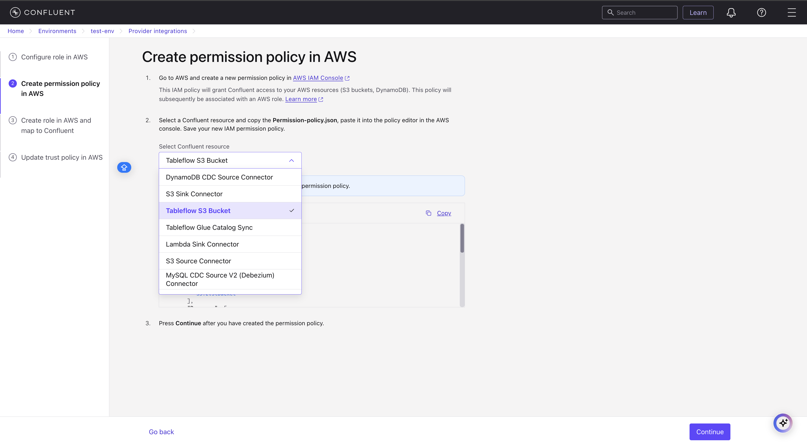
7.  **IMPORTANT:** Confluent Cloud will display a JSON permissions policy. **Copy this `permissions-policy.json`**. You will need it in the next step to create the IAM policy in AWS. Keep this Confluent Cloud wizard page open.


### Step 2: Create a New Permissions Policy on AWS

Use the policy JSON copied from Confluent Cloud to create an IAM policy in AWS that grants the necessary S3 permissions.

1.  In a new browser tab or window, go to the **IAM** service in your AWS Management Console.
2.  Click **Policies** in the left navigation pane.
3.  Click **Create Policy**.
4.  Select the **JSON** tab.
5.  Paste the `permissions-policy.json` you copied from the Confluent Cloud wizard into the JSON editor.
6.  **CRITICAL:** Find the `Resource` sections in the JSON policy and replace the placeholder bucket names (e.g., `tableflow-bucket-123456789101` in the document example) with your *actual* S3 bucket name created in Step 1 (e.g., `tableflow-bucket-<<Account-ID>>`). Make sure to update it in both places (e.g., `arn:aws:s3:::your-bucket-name` and `arn:aws:s3:::your-bucket-name/*`).

    ```json
    // Example structure from the document - ensure your bucket name is correct
    {
        "Version": "2012-10-17",
        "Statement": [
            {
                "Effect": "Allow",
                "Action": [
                    "s3:GetBucketLocation",
                    "s3:ListBucketMultipartUploads",
                    "s3:ListBucket"
                ],
                "Resource": [
                    "arn:aws:s3:::<<Your S3 Bucket Name>>" // Replace placeholder
                ]
            },
            {
                "Effect": "Allow",
                "Action": [
                    "s3:PutObject",
                    "s3:PutObjectTagging", // May differ slightly based on wizard version
                    "s3:GetObject",
                    "s3:DeleteObject",
                    "s3:AbortMultipartUpload",
                    "s3:ListMultipartUploadParts"
                ],
                "Resource": [
                    "arn:aws:s3:::<<Your S3 Bucket Name>>/*" // Replace placeholder
                ]
            }
        ]
    }
    ```

    

7.  Click **Next** (or Next: Tags -> Next: Review).
8.  Give the policy a descriptive **Name**, like `tableflow-s3-access-policy`.
9.  Click **Create Policy**.
10. Return to the **Confluent Cloud** provider integration wizard and click **Continue**.


### Step 3: Create role in AWS and map to Confluent
1. Next, we are going to create a role in AWS that will leverage the policy we just created, plus a trust-policy.json to allow Confluent to assume this role. 

2. Click [here](https://us-east-1.console.aws.amazon.com/iam/home#/roles) or navigate to the **Roles** sub-menu under the IAM service on AWS

3. Once on the Roles sub-menu, on the top right of the screen, click **Create role** in order to begin creating the role for Tableflow to assume.

4. For the trusted entity type, select **AWS account**.

5. Under An **AWS account**, select **This account**. In a later step, you modify the trust relationship and grant access to Snowflake.

6. Select the **Require external ID** option. Enter an [external ID](https://docs.aws.amazon.com/IAM/latest/UserGuide/id_roles_create_for-user_externalid.html) of your choice. For example, iceberg_table_external_id.
An external ID is used to grant access to your AWS resources (such as S3 buckets) to a third party like Snowflake.
    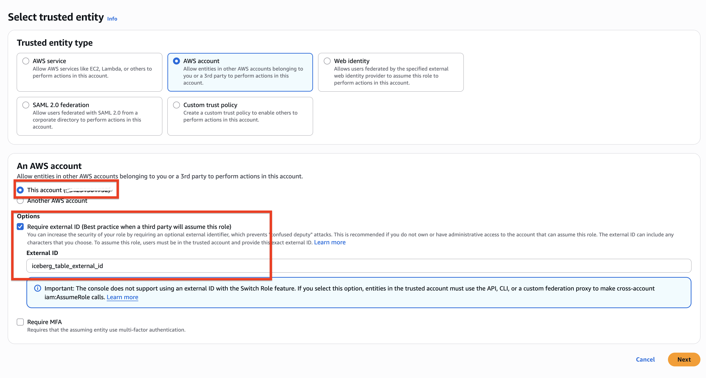

7. Scroll down and click Next

8. In the next page, Add Permissions, search for the policy you created in the previous step, named `tableflow-s3-access-policy` and attach it to the role. Click **Next**.
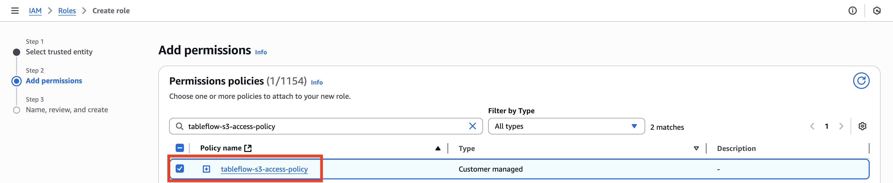

9. Give the role a name, `s3-tableflow-assume-role`, scroll down and **click Create Role**

10. Once the role is created, you should see a green banner at the top of the console stating that the role was created. Click **View Role** to see the role details.

    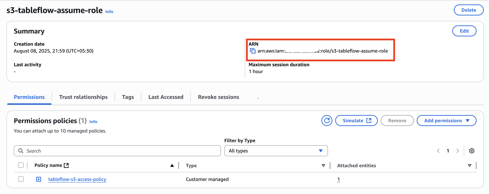

11. Copy the AWS ARN of the role and paste it in the Mapping component on the Provider Integration wizard on Confluent Cloud.

12. Give the Provider integration the name s3-provider-integration and click **Continue**.
    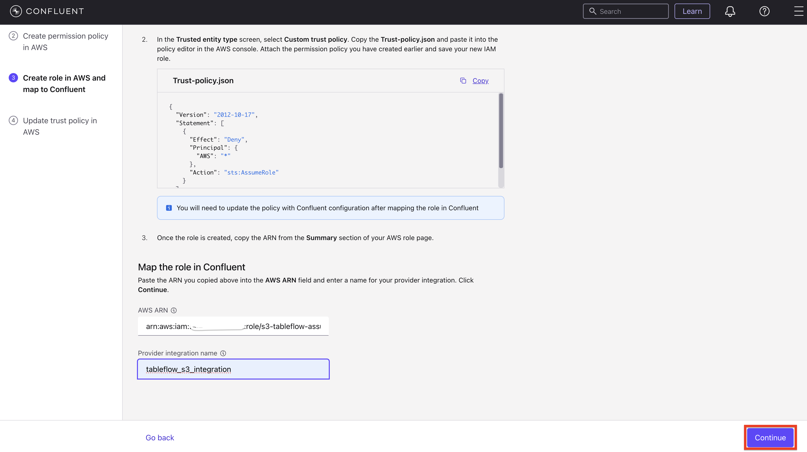

13. You will now copy the updated Trust Policy from Confluent which contains the Confluent External ID and role. Copy the `trust-policy.json` from Confluent to your clipboard.
    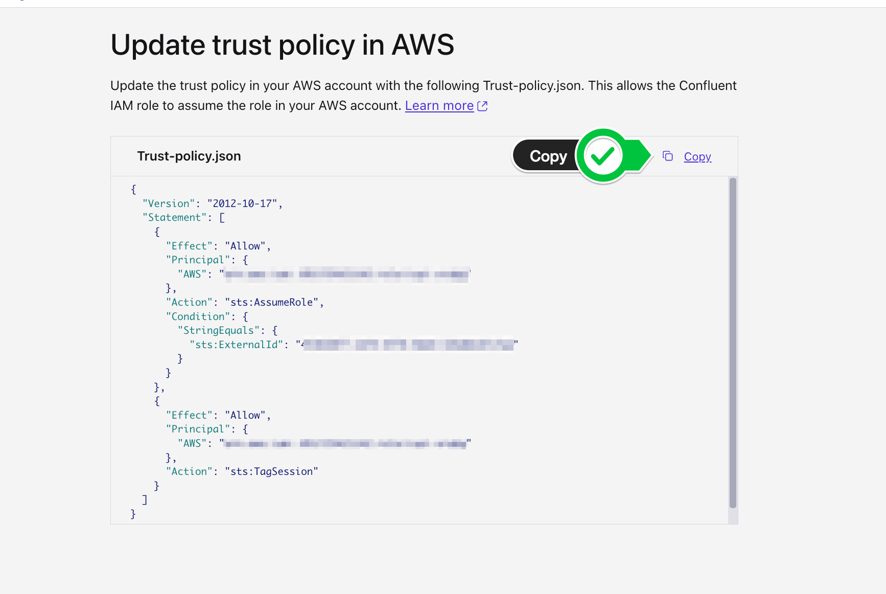

14. Go back to the **AWS IAM Role** you created (e.g., s3-tableflow-assume-role).

15. Select the **Trust relationships** tab.

16. Click **Edit trust policy** (or Edit trust relationship).

17. **Replace the entire existing JSON** with the updated `trust-policy.json` you copied from Confluent Cloud in the previous step. This adds the necessary External ID condition.

18. Click **Update policy** (or Save changes).

19. Return to the **Confluent Cloud** wizard one last time and click **Continue** (or Finish/Create).

    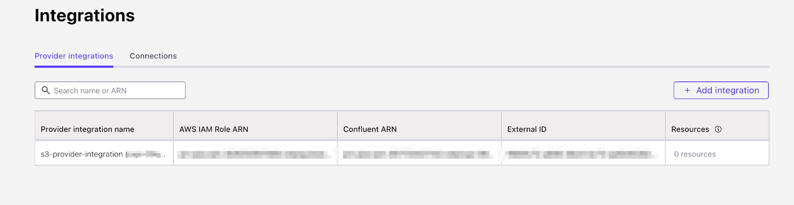


### Step 5: Enable Tableflow on Your Kafka Topic

With the Provider Integration successfully configured, you can now enable Tableflow for your desired Kafka topics.

1. In your Confluent Cloud console, go to your Environment, then select your Kafka Cluster.

2. In the left-hand navigation menu for your cluster, click on **Topics**. You should see a list of your topics.

3. Find the specific topic you want to enable Tableflow for in the list.

4. On the right-hand side of the row for that topic, in the "Tableflow" column, click the **Enable Tableflow** button/link.

    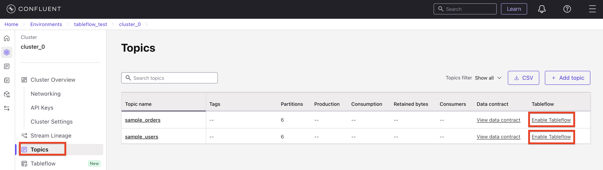
5. You will be asked to choose storage. Select Configure custom storage.
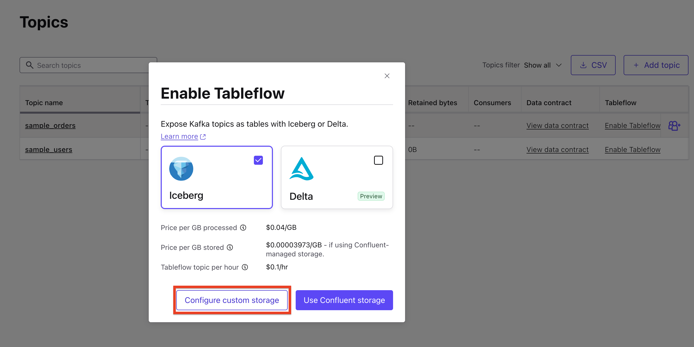
6. In the next menu, you will be able to choose the Provider Integration we created in the previous section. You can identify it by either the name of the provider integration or the IAM Role you created.

7. Provide the AWS S3 bucket name (`tableflow-s3-bucket`)
    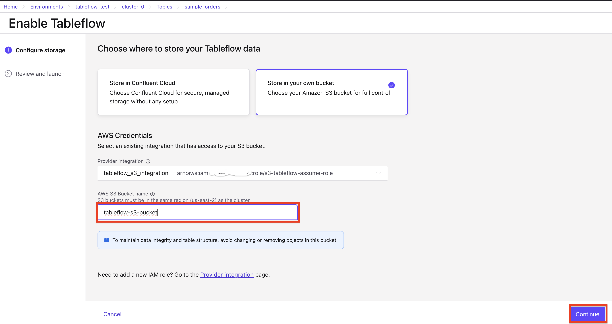

8. In the next screen, review the details and then click **Launch**.

9. You will now see *Tableflow* sync pending at the top of your topic information. This should transition to the *Syncing* status shortly.


### Query Iceberg Tables via Snowflake
Now that we’ve got our Snowflake Open Catalog set up receiving data from our Kafka topics, we can now see the full end-to-end integration by referencing our Snowflake Open Catalog within our Snowflake environment.

- Start by navigating back to your Snowflake environment. You can click this link in order to open your Snowsight UI.

- Open or Create a new SQL Worksheet by clicking **+ Create** at the top left hand corner, and select **SQL Worksheet**.

### Create an External Volume

- Ensure you have AccountAdmin Privileges granted to your account in order to create an external volume

- We will now create an external volume referencing our Amazon S3 bucket. Enter the following SQL statement, replacing the Amazon S3 bucket with the one you created earlier (`s3://tableflow-s3-bucket`), the IAM role you created earlier (`arn:aws:iam::<<account-id>>:role/s3-tableflow-assume-role`), and leave the rest.

```
CREATE OR REPLACE EXTERNAL VOLUME iceberg_external_volumes
   STORAGE_LOCATIONS =
      (
         (
            NAME = 'my-iceberg-external-volume'
            STORAGE_PROVIDER = 'S3'
            STORAGE_BASE_URL = 's3://tableflow-s3-bucket'
            STORAGE_AWS_ROLE_ARN = 'arn:aws:iam::<<account-id>>:role/s3-tableflow-assume-role'
            STORAGE_AWS_EXTERNAL_ID = 'snowflake-external-id'
         )
      );

```

- Execute this statement by highlighting the text and clicking the Play button  ▶️ to the top-right.

    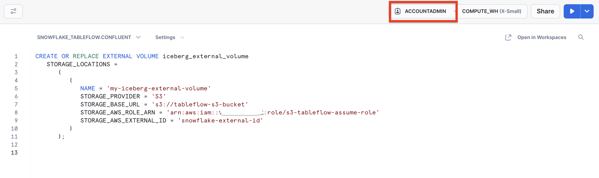

- You will see the success message appear at the bottom of the page, showing that the external volume was successfully created.

- We need to get the `STORAGE_AWS_IAM_USER_ARN` to provide to our IAM Role trust policy. We can do so by running a describe query on the external volume we just created.
```
DESC EXTERNAL VOLUME iceberg_external_volume;
```
- Run this command like we did with the first command by highlighting the text and clicking on the Play button  ▶️to the top right.

    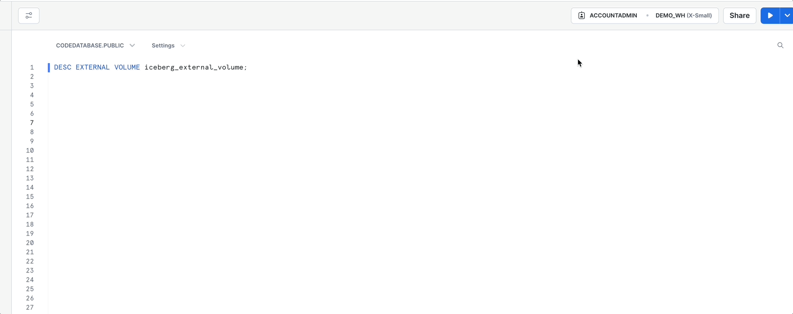

- The output of this command will appear at the bottom of the page. Under the results for `STORAGE_LOCATIONS` there will be a `property_value`, click this value to see the results on the right hand side.

- From the value of the `property_value` column, copy the value of `STORAGE_AWS_IAM_USER_ARN` which should look like an IAM ARN
    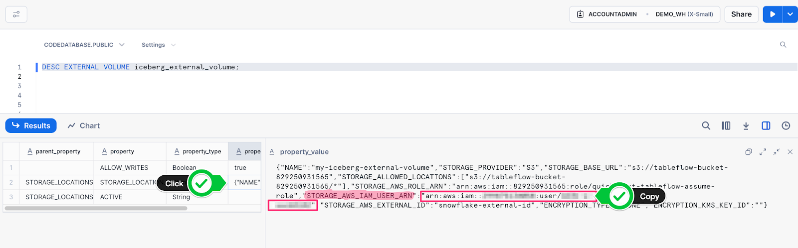

### Update Trust Policy for Snowflake
- Let’s now navigate back to our AWS IAM Role that we created previously (s3-tableflow-assume-role) and update the trust policy again:
  - Navigate back to your Role on AWS and switch to the Trust Relationships tab
  - Click Edit Trust Policy

- We will again be adding another entry to our trust policy under the Statement block that will look like this:
```
{
			"Sid": "",
			"Effect": "Allow",
			"Principal": {
				"AWS": "<<STORAGE_AWS_IAM_USER_ARN>>"
			},
			"Action": "sts:AssumeRole",
			"Condition": {
				"StringEquals": {
					"sts:ExternalId": "iceberg_table_external_id"
				}
			}
  }
  ```
- Under the AWS key, paste your `STORAGE_AWS_IAM_USER_ARN` which was copied from snowflake query (`DESC EXTERNAL VOLUME iceberg_external_volume;`)

- Keep the external ID as `iceberg_table_external_id` as that’s the external ID we created in the external volume

- Once you add the extra trust policy, your full trust policy should look like this:

```
{
	"Version": "2012-10-17",
	"Statement": [
		{
			"Effect": "Allow",
			"Principal": {
				// from Confluent
				"AWS": "arn:aws:iam::<<account-id>>:role/<<role-id>>"
			},
			"Action": "sts:AssumeRole",
			"Condition": {
				"StringEquals": {
					// from Confluent
					"sts:ExternalId": "<<external-id>>"
				}
			}
		},
		{
			"Effect": "Allow",
			"Principal": {
				// from Confluent
				"AWS": "arn:aws:iam::<<account-id>>:role/<<role-id>>"
			},
			"Action": "sts:TagSession"
		},
{
            "Sid": "",
            "Effect": "Allow",
            "Principal": {
		   // from Snowflake 
                "AWS": "arn:aws:iam::<<account-id>>:role/<<role-id>>"
            },
            "Action": "sts:AssumeRole",
            "Condition": {
                "StringEquals": {
		   // from Snowflake
                    "sts:ExternalId": "snowflake-external-id"
                }
            }
        }
	]
}
```
The next step is verifying that we can actually access the external volume via Snowflake. Execute this command:
```
SELECT SYSTEM$VERIFY_EXTERNAL_VOLUME('iceberg_external_volume');
```
- When this runs, you should see the keywords “success”:”true” and “PASSED” in the results set. This means the trust policy update took effect.

### Create a Tableflow API Key
1. Click on the hamburger icon (three horizontal lines) in the top right of the screen.

2. Click **API Keys** in the menu under Administration.

3. Click **Create Key** in order to create your first API Key. If you have an existing API Key, click **+ Add Key** to create another API Key.
    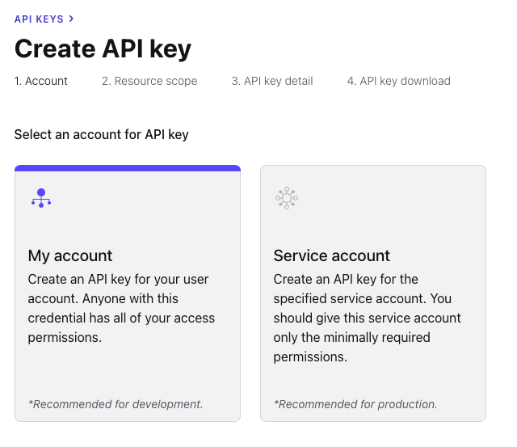
4. Select **My account** and then click **Next**.

5. Select **Tableflow**, Click **Next**.

    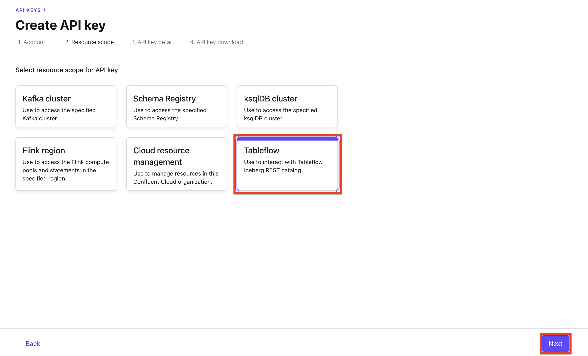

6. Give your API Key a name.

7. Enter a description for your API Key (e.g. `API Key to Tableflow Integration`).

8. Click **Create API Key**.

9. Click **Download API key** to save both the Key and Secret to your computer.

10. Click **Complete**.

### Create Catalog Integration

We can now create our catalog integration, to link Snowflake to our Snowflake Open Data Catalog. For this SQL statement you will need to retrieve some information in the placeholders. Start by pasting in this placeholder create statement into your SQL worksheet.

```
CREATE OR REPLACE CATALOG INTEGRATION tableflow_rest_catalog_integration
    CATALOG_SOURCE=ICEBERG_REST
    TABLE_FORMAT=ICEBERG
    CATALOG_NAMESPACE='<cluster-id>'
    REST_CONFIG = (
        CATALOG_URI = 'https://tableflow.<region>.aws.confluent.cloud/iceberg/catalog/organizations/<org>/environments/<envID>'
        CATALOG_API_TYPE = PUBLIC
    )
    REST_AUTHENTICATION=(
        TYPE=OAUTH
        OAUTH_CLIENT_ID='<Tableflow-API-Key>'
        OAUTH_CLIENT_SECRET='<Tableflow-API-secret>'
        OAUTH_ALLOWED_SCOPES=('catalog')
    )
ENABLED=true;
```

**Note**: a. `CATALOG_NAMESPACE` should be your Kafka cluster ID. This can be found by navigating to your Confluent Cloud Kafka cluster and checking the cluster details on the right hand menu. **Copy this value and paste it in the value for CATALOG_NAMESPACE**.

b. The next placeholder, `CATALOG_URI` will be your `REST Catalog Endpoint`(Found in Confluent Cloud Console → Your Environment → Your Cluster → Tableflow → "**REST Catalog Endpoint**" (copy this exact URL to use as your CATALOG_URI value))

c. For the OAUTH client ID and client secret, these are the **Tableflow API key** and **secret** values you created in the previous step when setting up API access in Confluent Cloud. Copy and paste these values as appropriate.

- You are now ready to create your catalog integration. Highlight the command and click the Play button just as before. 

- After running the command, you should see that the catalog integration was successfully created.

    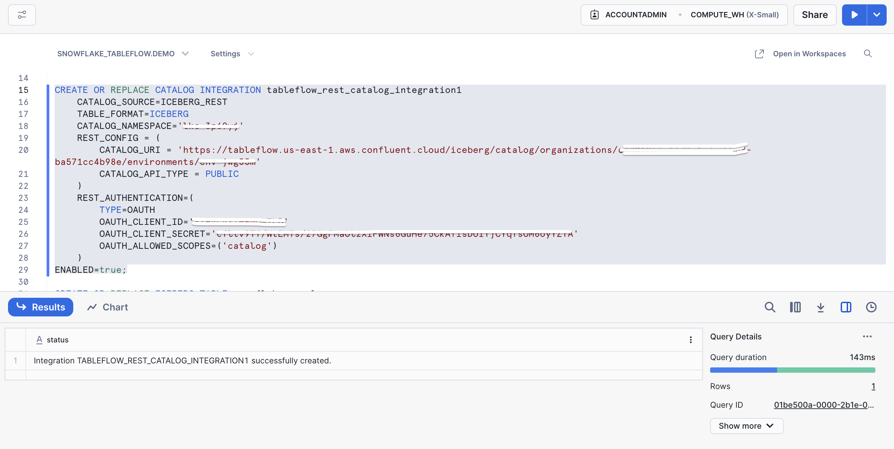
- After running the command, you should see that the catalog integration was successfully created.

### Creating the Iceberg Table and Querying
- Once we have the catalog integration set up, you can now create an Iceberg table to query your snowflake open data catalog data.

- Execute the following command, ensuring that all variables match exactly. If you named your external volume, catalog or kafka topic something different, this query will not work:

```
  CREATE OR REPLACE ICEBERG TABLE confluent_orders
  EXTERNAL_VOLUME = 'iceberg_external_volumes'
  CATALOG = 'tableflow_rest_catalog_integration1'
  CATALOG_TABLE_NAME = 'sample_orders';
```
  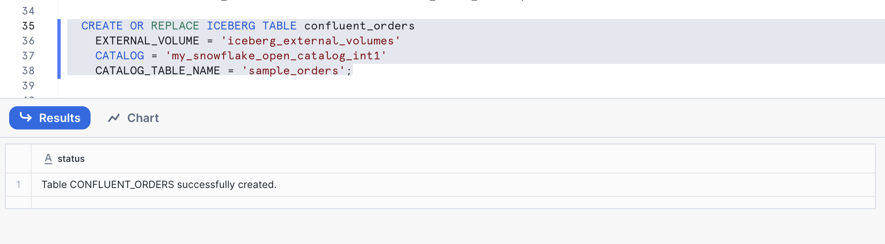

- Finally we are ready to query the table. Here are some queries you can try and evaluate the results.
```
-- count the number of records
SELECT COUNT(*) from confluent_orders;
-- see one record in the table
select * from confluent_orders limit 1;
-- see all records in the table
SELECT * FROM confluent_orders;
```

These query results should update periodically when run again, showcasing that we are continuously writing data to our Iceberg tables.

With Tableflow Catalog Integration, Tableflow acts as the catalog provider. Kafka topics are materialized as Iceberg tables stored in cloud storage (such as S3) and registered with Tableflow's built-in REST Catalog. Snowflake connects to this Tableflow REST Catalog as an external compute/query engine, using API credentials (API key and secret) generated within the Confluent Cloud Console. All metadata and table management remain under Tableflow’s control, and authentication is handled via Tableflow’s REST API keys—not Snowflake OAuth or native service connections. This approach is ideal when you want centralized catalog operations within Tableflow, while enabling Snowflake to query and analyze data without transferring catalog ownership.

